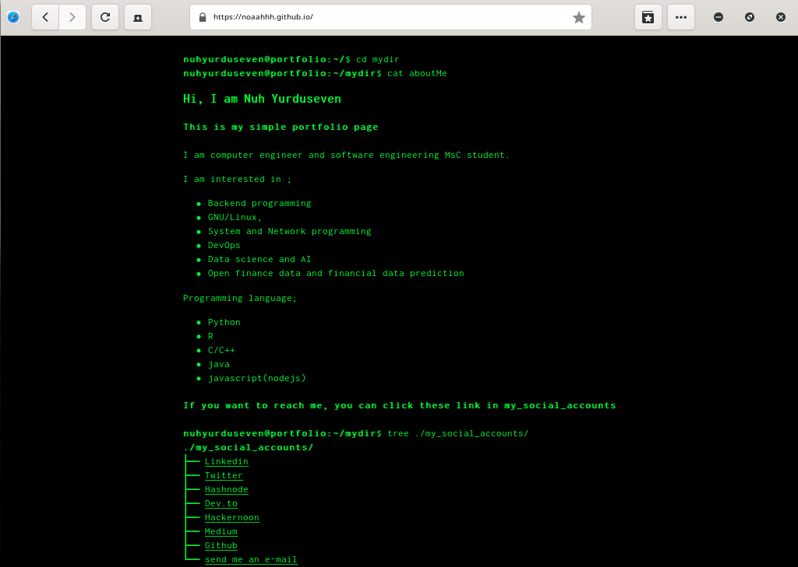

 # This is my portfolio site

 <div align="center">
  <h3>My portfolio site and theme using Hugo and Shell theme </h3>
  
  
  <a href="https://github.com/noaahhh/portfolio/issues"></a>
  <a href="https://github.com/noaahhh/portfolio/stargazers"></a>
  <a href="https://github.com/noaahhh/portfolio/blob/main/LICENSE"></a>
</div>

## About 
 It's my portfolio web site created with Hugo framework and using Hugo-theme-shell.  
## Installation
To clone with git
```sh 
$ git clone https://github.com/noaahhh/portfolio.git /path/to/your/site
$ cd  /path/to/your/site
```
then run the command at your site's root directory
``` sh
$ hugo serve 
```
to build the site,
```sh 
$ hugo 
```
You can see the site **/public** directory. 
## Related article and shares
**Turkish**

[Hugo-github pages ile basit bir static web sitesi oluşturup yayınlama](https://noaahhhtech.hashnode.dev/hugo-github-page-ile-basit-bir-static-web-sitesi-olusturup-yayinlama)

[**English**]

[Creating static web sites using hugo](https://www.dev.to/noaahhh/creating-static-web-sites-using-hugo-4f1k)
